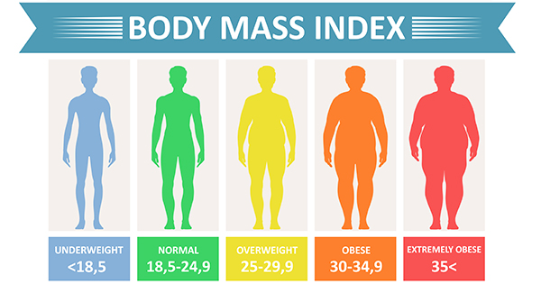

<style>                     
.navbar {
background-color: #62B1DF;
border-color: #215D80;
}
.navbar-brand {
color: white!important;
}
.navbar-inverse .navbar-nav > .active > a, .navbar-inverse .navbar-nav > .active > a:hover, .navbar-inverse .navbar-nav > .active > a:focus {
    color: white;
    background-color: #8EC7E8;
    font-weight: bold;
}
.fa {
color: white;
}

.navbar-inverse .navbar-nav > li > a {
color: white;
}

.navbar-inverse .navbar-nav > li > a:hover {
color: white;
}
</style>   


```{r setup, include=FALSE}
knitr::opts_chunk$set(echo = FALSE)
#knitr::opts_chunk$set(fig.height=3, fig.width=4)
```

```{r lib, include=FALSE}
library(tidyverse)        # functions that help get to tidy data
library(dplyr)            # grammar of data manipulation
library(ggplot2)          # grammar of graphics
library(stringr)          # consistent wrappers for common string operations
library(countrycode)      # convert country names and country codes
library(lubridate)        # dealing with data easier
library(RColorBrewer)     # color palette
library(viridis)          # color for daltonian
library(tmap)             # package for maping
library("gridExtra")      # package pour fusionner des graphes
library("cowplot")        # package pour fusionner des graphes
library("flexdashboard")  # create a flexdashboard
```


```{r data dep, include=FALSE}
# importation des données
data = read.csv("data/obesity-cleaned.csv",sep=",",header=T)
summary(data)

# Import des données countries of the world
data = data[,-1]
data$Country = as.factor(data$Country)
data$Year = as.factor(data$Year)
data$Sex = as.factor(data$Sex)

# on découpe la variable obésité en 2 : pourcentage et intervalle de confiance
data = data %>% rename(Obesity = Obesity....) %>% 
  mutate(Std_Dvt= sub(".* ", "", Obesity)) %>%
  mutate(ObesityPercentage=as.double(sub(" .*", "", Obesity))) %>%
  filter(!is.na(ObesityPercentage)) %>% # supp les na
  select(Country, Year, Sex,Obesity=ObesityPercentage, Std_Dvt)

# Ajout des pays au format Iso3 pour la fusion des 2 fichies
data = data %>% 
  mutate(CountryISO =countrycode(Country, origin="country.name", destination = "iso3c"))

#on merge avec World où on a direct les continents 
# importation des données du monde nécessaire à la carto
data("World")
colnames(World) = c("CountryISO",colnames(World[-1]))
obesitycountries2 <- left_join(data, World, by= "CountryISO")
```


```{r graph1, include=FALSE}
# un graph moyenne mondiale de l'obésité selon les années (homme et femme)

# pondéré par le nombre d'habitants : 

all_obesity_country = filter(obesitycountries2, Sex=="Both sexes")

df = all_obesity_country[c("Country","Year","pop_est","Obesity")]
summary(df)

# sup des données manquantes pour la pop
df=df[!is.na(df$pop_est),]

# calcul de la moyenne pondérée par an
w_all_year = tapply(seq_along(df$Obesity),df$Year,
       function(xx){return(weighted.mean(x=df$Obesity[xx],w=df$pop_est[xx]))})

w_all_year = as.data.frame(cbind(year=1975:2016,mean=w_all_year))
w_all_year$year = as.factor(w_all_year$year)

# convertion au format date
w_all_year <- mutate(w_all_year, date = str_c(w_all_year$year, "01-01", sep = "-") %>% ymd())

# representation graphique
theme_strip <- theme_minimal()+
  theme(axis.text.y = element_blank(),
        axis.line.y = element_blank(),
        axis.title = element_blank(),
        panel.grid.major = element_blank(),
        axis.text.x = element_text(vjust = 3),
        panel.grid.minor = element_blank(),
        plot.title = element_text(size = 14, hjust=0.5, face = "bold"),
        plot.caption = element_text(face = "italic", hjust=0.5))

col_strip <- brewer.pal(11, "RdYlGn")

plot1 = ggplot(w_all_year,
       aes(x = date, y = 1, fill = mean))+
  geom_tile()+
  scale_x_date(date_breaks = "6 years",
               date_labels = "%Y",
               expand = c(0, 0))+
  scale_y_continuous(expand = c(0, 0))+
  scale_fill_gradientn(colors = rev(col_strip))+
  guides(fill = guide_colorbar(barwidth = 1))+
  labs(title = "Obesity 1975-2016",
       caption = "Data : Adult obesity, population-weighted by country, between 1975-2016.",
       fill="Obesity %")+
  theme_strip
```

```{r graph2, include = FALSE}
# courbe d'évolution de l'obésite par continent 

# 1 avec dataset World et région non continents
all_obesity_country = filter(obesitycountries2, Sex=="Both sexes")

# voir pour rajouter les pays enlevés 

all_obesity_country=all_obesity_country[!is.na(all_obesity_country$pop_est),]
all_obesity_country=all_obesity_country[!is.na(all_obesity_country$continent),]

obesity_by_region = all_obesity_country %>% 
  group_by(continent, Year) %>% 
  summarise(TotalPopulation = sum(pop_est), AvgObesity = mean(Obesity),
            weighted_mean = weighted.mean(x=Obesity,w=pop_est))
              

plot2 = ggplot(obesity_by_region, aes(Year,weighted_mean,color=continent)) +
  ggtitle("Obesity evolution from 1975 to 2016 by continent") +
  geom_line(aes(linetype=continent, group=continent), linetype="solid", size=1.5)+
  scale_x_discrete(breaks = seq(1975, 2016, 10)) +
  scale_colour_discrete(name  ="Continent",
                        breaks=c("North America", "Oceania", "Europe", "South America", "Africa", "Asia"))+
  xlab('Year') +
  ylab('Obesity %') +
  theme_minimal() 
  #scale_color_brewer(palette = "Dark2")

#plot2
```


```{r carte1975, include = FALSE}
# 2 graphs : carte avec l'obésite par pays en 1975 et en 2016

# Carte 1975 --------------------

# création d'un fichier avec taux d'obésité par pays en 1975
obesity_1975 = filter(obesitycountries2, Year=="1975")
obesity_1975 = filter(obesity_1975, Sex=="Both sexes")
obesity_1975 = filter(obesity_1975, CountryISO!="ATA")
World=filter(World, CountryISO!="ATA")

# on fusionne les données du monde et notre dataset sur l'obésité en 2016 (grace à CountryISO)
obesity_1975_world <- World %>%
  left_join(obesity_1975)

# carte choroplèthe selon l'obésité en 1975
carte1 <- obesity_1975_world %>% 
  ggplot() + 
  geom_sf(aes(fill = Obesity),color="white",size=.2)+
  theme_void()+
  theme(panel.background = element_rect(fill = "white"))+
  scale_fill_gradientn(colors = rev(col_strip), limits = c(0, 40),
                       breaks=c(10, 20, 30))+
  guides(fill = guide_colorbar(barwidth = 1))+
  labs(title = "Obesity rates by country in 1975",
       caption = "Data : Adult obesity by country in 1975.",
       fill="Obesity %")
#carte1
```

```{r carte2016, include = FALSE}
# CARTE 2016 
# création d'un fichier avec taux d'obésité par pays en 2016
obesity_2016 = filter(obesitycountries2, Year=="2016")
obesity_2016 = filter(obesity_2016, Sex=="Both sexes")
obesity_1975 = filter(obesity_1975, CountryISO!="ATA")
World=filter(World, CountryISO!="ATA")

# on fusionne les données du monde et notre dataset sur l'obésité en 2016 (grace à CountryISO)
obesity_2016_world <- World %>%
  left_join(obesity_2016)

# carte choroplèthe selon l'obésité en 2016
carte2 <- obesity_2016_world %>% 
  ggplot() + 
  geom_sf(aes(fill = Obesity),color="white",size=.2)+
  theme_void()+
  theme(panel.background = element_rect(fill = "white"))+
  scale_fill_gradientn(colors = rev(col_strip),limits = c(0, 40),
                       breaks=c(10, 20, 30))+
  guides(fill = guide_colorbar(barwidth = 1))+
  labs(title = "Obesity rates by country in 2016",
       caption = "Data : Adult obesity by country in 2016.",
       fill="Obesity %")
#carte2
```


Preview {data-icon="fas fa-home"}
===================================== 

Row {data-height=400}
-------------------------------------
    
### Worldwide evolution of obesity

```{r preview graph 1}
# affichage du 1er graph
plot(plot1)
```
   
### Evolution of obesity by continents

```{r preview graph 2}
plot(plot2)
```
    
Row {data-height=600}
-------------------------------------
    
### Evolution of obesity by country

```{r preview carte1}
grid.arrange(carte1, carte2, nrow = 2, ncol=1)
```

Explanations {data-icon="fas fa-wrench"}
=====================================     

### Explanation of the data set

We use a dataset from _Kaggle_ to study obesity over time. 

According to the WHO, a person is overweight when his or her body mass index (BMI) is above 25 and obese when it is above 30. The problem has reached epidemic proportions as of 2017, more than 4 million people were dying each year from overweight or obesity, according to a Global Burden of Disease study.

<br/>

<br/>

<center>
{width=50%}
</center>

<br/>

<br/>

The dataset has 6 variables: 

- country
- the year 
- BMI
- the confidence interval
- gender 


Here is an extract from our obesity dataset:

```{r echo=FALSE, out.width="90%"}
knitr::kable(data[1:5,1:5])
```    

In order to be able to make maps we also imported the World dataset from R. This dataset allows us to have the names of the countries in ISO3 format and to obtain various information about the countries, such as the number of inhabitants. Here is an extract of the dataset:

```{r echo=FALSE, out.width="90%"}
knitr::kable(World[1:5,1:5])
```   


Worldwide evolution {data-icon="fa-signal"}
=====================================     

### Global evolution
    
```{r graph 1}
# Affichage de la carte dans une page unique
plot(plot1)
```

Evolution by continent  {data-icon="fa-signal"}
=====================================      
### Obesity trends by continent

```{r graph 2}
plot(plot2)
```

Evolution by country {data-icon="fa-globe"}
=====================================     

### Evolution by country 

```{r carte2}
grid.arrange(carte1, carte2, nrow = 2)
```


